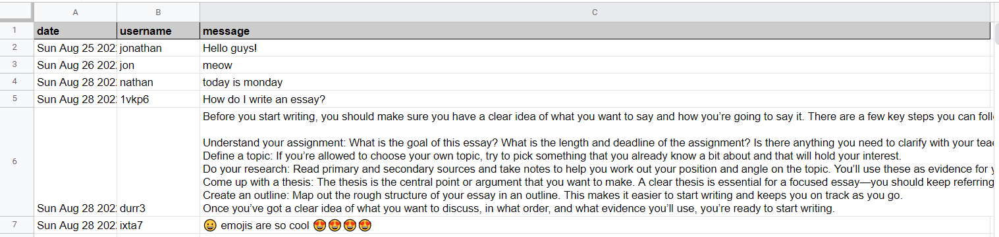
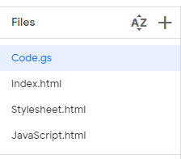

# 💬 1bxoxb1

1bxoxb1 is a no-login real-time online chat app using Google Sheets as backend.

This project is a proof of concept for using Google Sheets as a server. 

[▶ Live Preview](https://script.google.com/macros/s/AKfycbz3_jQSeelwylADfsLTh0hqxqqkGsoYyRG19UilpUde2dDJCjv79H3tOjrJMzp_DxrpbA/exec)

> ⚠ If you encounter the error "Sorry, unable to open the file at this time."
 when clicking on the above link, try opening it in an incognito tab.
# 🚀Features
- Free.
- No login required.
- Each user is assigned a random name.
- Does not collect personal data or cookies.
- Responsive UI for all screen sizes.
- Chat supports emojis and paragraphing.

# 🦴How it works
> Front-end : HTML, CSS, JS

> Back-end : Google Sheets, AppScript

- A spreadsheet on my Google Sheet account stores all required information (date, username, message).

- Every 2 seconds browser sends calls backend function `getSpreadsheetData()`.

- `getSpreadsheetData()`, written in AppScript, sends a request to read spreadsheet using Sheets API.

- `getSpreadsheetData()` forwards data to the browser after parsing it.

- New messages since last call are added to HTML.

# ✋Limitations
- A maximum of 30 concurrent users.
- Google Sheet API allows at most 300 requests per minute.

# 🔨 How to create your own chat app 
- First you need a Google account.
- Create a spreadsheet on GoogleSheets. The name of the file is not important.
- Add the following header to your `Sheet1`.

- All messages will be saved in `Sheet1`.

## Create an appscript project
- Go to https://script.google.com/home then create a new appscript project. The project name is not important. 

- In your appscript project, manally create the following files.

- Fill these files with the content found in the `appscript` folder in my github repo.

- In `Code.gs` file, set `SPREADSHEET_URL` to the URL of your spreadsheet.

## Deploy project

- Deploy your project as a web app.
- The web app requires you to authorize access to your data.
- Configure the settings as you want then deploy.

# 📌 Attributions
Resource | Source
---|---
[avatar in project image](assets/img/1bxoxb1.png) | [janet mac](https://janet-mac.com/google-avatar-project)

# 🔨 To-Do
- [ ] Implemenet exponential backoff algorithm.
- [ ] Embed app as iframe on another website.
- [ ] Add sitemap + request indexing.

### ✔ Done
- [x] Make website responsive.
- [x] Add project social media preview.
